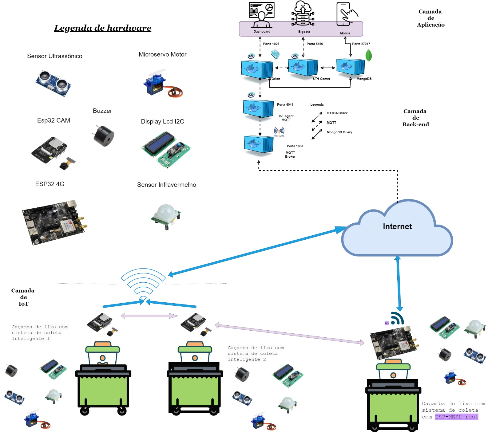

# Lixeiras Inteligentes - Longest Wave Tech

## Visão Geral

As lixeiras inteligentes da Longest Wave Tech possuem um sistema inteligente de gerenciamento de resíduos que utiliza a tecnologia IoT (Internet das Coisas) para monitorar, alertar e melhorar o gerenciamento de lixeiras. Este sistema é projetado para melhorar a eficiência e reduzir o esforço humano envolvido na coleta e monitoramento de resíduos sólidos por meio da integração de dispositivos IoT.

## Draft da arquitetura

## Componentes Utilizados

- Módulo ESP32 4G
- Sensor Ultrassônico HC-SR04
- Módulo Buzzer
- Display LCD I2C
- Sensor Infravermelho (IR)
- Microservo Motor
- Protoboard
- Jumpers
- Lixeiras

## Funcionamento

São utilizados sensores ultrassônicos para monitorar a altura do lixo na lixeira. O transmissor ultrassônico emite uma onda ultrassônica que viaja pelo ar e, quando atinge qualquer material, é refletida de volta em direção ao sensor.

Além disso, um sensor infravermelho (IR) é utilizado para detecção de movimento, permitindo que o Smart Bin saiba quando alguém se aproxima para descartar o lixo.

### Buzzer, Display LCD e Microservo Motor

- Quando a capacidade da lixeira atinge um determinado limite (por exemplo, 75%), o módulo Buzzer é ativado, emitindo um sinal sonoro para alertar que a lixeira está quase cheia.
- O Display LCD I2C exibe a capacidade atual da lixeira, permitindo uma visualização conveniente.
- O microservo motor pode ser usado para abrir automaticamente a tampa da lixeira quando alguém se aproxima para descartar o lixo. O motor pode ser controlado pelo ESP32 4G para facilitar o descarte de lixo sem a necessidade de tocar na tampa.

## Website e Dashboard

O projeto também inclui um website dedicado. Este website contém um painel de controle com informações sobre as diferentes lixeiras, sua capacidade atual e status de ocupação. O painel exibe a localização das lixeiras em um mapa para uma melhor visualização. Os dados são atualizados regularmente e fornecem uma visão abrangente do estado das lixeiras.

## Requisitos do Sistema

Requisitos Funcionais:
- Alertar a central quando a lixeira está prestes a atingir a capacidade máxima.
- Exibir o status da caçamba no display (lotada, quase lotada ou vazia).
- Ativar o display LCD por meio de um sensor de proximidade.
- Medir quando o compartimento da lixeira menor está cheio.
- Enviar dados para a nuvem.
- Monitorar constantemente o volume de resíduos armazenados.
- Analisar áreas com maior incidência de lotação das lixeiras.
- Consultar localização e disponibilidade das caçambas para cidadãos.

Requisitos Não Funcionais:
- Comunicação com a Internet para transmissão de dados.
- Utilização do Google Maps para localização e cálculo de rotas.
- Utilização de dispositivos ESP32 para controle e comunicação.
- Utilização de dashboard de terceiros para visualização de dados.
- Utilização de domínio de site na internet para acesso aos dados.
- Utilização de conexão 4G/3G para comunicação entre dispositivos.

## Instruções de Uso

Instruções de Uso para Cidadãos:
- Consultar Localização e Disponibilidade das Caçambas
- Baixe o aplicativo Clean Can ou acesse o site.
- Faça login informando seu CPF, e-mail e endereço.
- Na aba de localização, visualize todas as caçambas de lixo mais próximas no mapa.
- Clique nas caçambas no mapa para ver a média do nível de lotação nas últimas horas.
- Se uma caçamba estiver lotada, o aplicativo ou site indicará a caçamba disponível mais próxima.

Instruções de Uso para Departamento de Análise de Dados:
- Analisar Dados Coletados
- Faça login no sistema Clean Can como membro do Departamento de Análise de Dados.
- Acesse o dashboard para recuperar dados coletados.
- Utilize as abas do dashboard, como avisos do dia e localizações de lixeiras, para coletar os dados necessários.
- Realize cálculos e análises dos dados para identificar incidências de lotação e suas localizações.
- Categorize as informações coletadas e utilize mapas e categorias no dashboard.
- Forneça recomendações à equipe de coleta seletiva e verifique os avisos de limpeza.
- Repasse os avisos de limpeza ao departamento de limpeza da empresa.

Instruções de Uso para Departamento de Coleta de Lixo:
- Coletar Caçambas de Lixo
- Saia da central com a rota já carregada nos dispositivos.
- Siga a rota, coletando os resíduos das caçambas de lixo ao longo do caminho.
- Marque cada caçamba coletada no sistema para acompanhamento.
- Após a coleta da última caçamba da rota, retorne à central ou siga para a próxima rota, visando a eficiência no uso de recursos.

Instruções de Uso para Departamento de Análise de Dados (Montar Rota de Coleta):
- Calcular Rota de Coleta
- Acesse o sistema e vá para a aba de avisos do dashboard.
- Selecione os avisos de maior urgência de uma mesma região.
- Utilize a funcionalidade "Montar Rota Otimizada" para criar uma rota eficiente.
- Receba a rota mais rápida que economize combustível para as caçambas selecionadas.
- Confirme a rota e selecione um caminhão de lixo disponível.
- Envie a rota ao dispositivo do caminhão.

